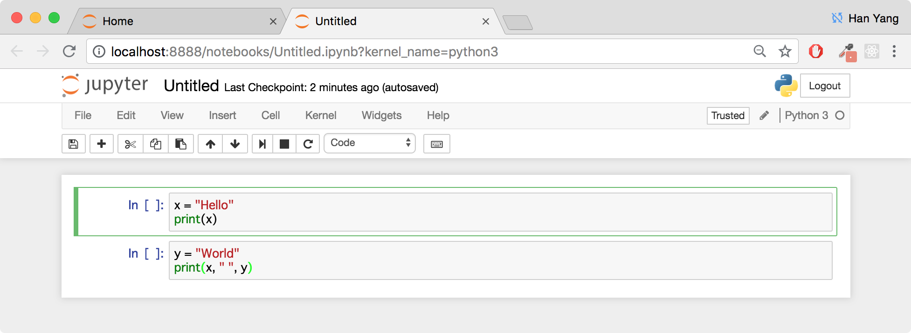

# COMP419 Jupyter Notebook Tutorial

In this class, we will use [Jupyter](https://jupyter.org/) notebooks for the programming assignments. Think of it as an interactive Python shell: a notebook lets you write and execute Python code in your web browser.

It is easy to tinker with code and share your findings with other people, and thus it is widely used in data science teams and scientific computing.

The following assumes that you have already installed Jupyter on your computer. If not, you should check out the setup tutorial.

Start the Jupyter notebook server by running this command:

```
jupyter notebook
```

You can then access your notebooks, usually at `http://localhost:8888` or if you're working remotely on a virtual machine, `http://EXTERNAL-STATIC-IP:8888`. 

If everything worked correctly, you should see a similar screen that reveals all Jupyter notebooks in the current directory.


**Tip**: Start your servers at the root of your homework folder, so that you can easily access the notebooks you need.

A notebook looks like this:



A Jupyter notebook is made up of **cells**. Each cell can contain Markdown (that's how I display text) or Python code. 

You can execute a cell with Python code by clicking on it and pressing `Shift-Enter`. 

This runs the code and displays the output below the cell. Global variables are shared between cells. Hence, we can call `x` in the second cell even though it was initialised in the first cell.


Jupyter notebooks are expected to be run completely, in sequence. Executing cells out of order, or forgetting to execute cells may result in errors.


Remember to **save your changes** by running `Ctrl+S / ⌘ + S / clicking` . 


Sometimes, when running into problems, it may be helpful to rerun a cell, or even clear all output and rerun the entire notebook, or even restart the kernel.


For this course, I'll try to plan for the assignments to be contained within the notebook (i.e. your assignment submissions will be the entire notebook with your code + saved output).
