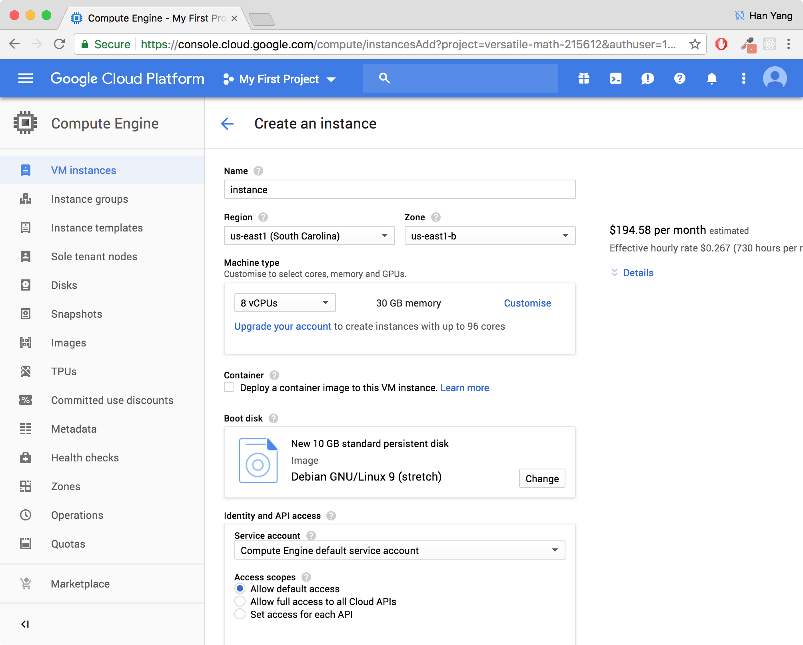
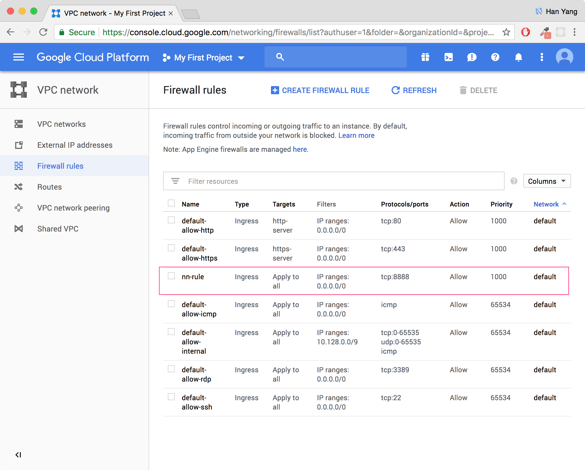

# Setup

You can choose to setup 1) locally on your own machine or 2) remotely on a virtual machine on Google cloud.

## Working locally


1. Install [Miniconda](https://conda.io/miniconda.html) for **Python 3**. It is a python distribution that makes it easy to handle package dependencies, and is the backbone of [Anaconda](https://www.anaconda.com/download).


2. If you are running several Python projects, consider installing a virtual environment. If you choose not to do so, it is up to you to install all dependencies for the code globally on your machine.

To create a virtual environment:
`conda create -n comp419 python=3.7 anaconda`

To enter the environment (run this every time you are working on the assignment):
`source activate comp419`

To exit, close the window, or:
`source deactivate comp419`

3. For now, install the following:
```
conda install numpy
conda install matplotlib
conda install jupyter
```
This is the command you should run whenever you are unable to import a certain package.

## Working remotely on Google Cloud

This is up here for anyone who wishes to use Google Cloud for your assignments. If you have a Gmail account and sign up for Google cloud, you'll receive $300 credits, which is definitely sufficient for surviving this class if you are wary of how much you're spending.

This will be helpful for anyone who is having trouble with working locally, or if you need better CPU/GPU resources than you may have locally.

This setup process is more tedious, but some of you might find it useful in case you wish to try this in the future.

### REMINDER: Stop your instances!
If you don't, your credits will be squandered while you're idling. Make sure to stop the instance whenever you're done!

### Create Google Cloud account

Head over to [Google Cloud](https://cloud.google.com/) and click on the blue `Try free` button on the top right.


Review the Terms of Service and at the next page, fill in the requested information. **Change account type to INDIVIDUAL**.


Press the blue `Start my free trial` button. On the landing page, click the *top right menu button*:


Go to **Compute Engine**, then **VM Instances** and click on the blue button to create a new instance:


Set zone to be **us-east1-b**. Under **Machine type** choose 8vCPUs, 30GB memory. We won't be using GPUs anytime soon. So, set it to **None**.



Click on **Change** button under **Boot disk**. Pick **Ubuntu 16.04 LTS** and change size of boot disk to ** 40 GB**.


After clicking **Select**, you should check **Allow HTTP traffic** and **Allow HTTPS traffic**. Expand the **management, security, networking**. 


Select **Disks** tab, and uncheck **Delete boot disk when instance is deleted**.


Click on the blue **Create** button. This will take a few minutes, but once the Google Compute instance is ready, it looks like this: 


#### Connect to your virtual machine!

First, download the [Google Cloud SDK](https://cloud.google.com/sdk/docs/) and perform the optional step 4 to add the SDK tools to your path.

Now, we can connect by running this:
```
gcloud compute ssh --zone=us-east1-b <YOUR-INSTANCE-NAME>
```
#### First time setup

Now, we have to install [Miniconda](https://conda.io/miniconda.html) for **Python 3** by running:

```
// download install script
wget 
https://repo.continuum.io/miniconda/Miniconda3-latest-Linux-x86_64.sh

// add execute permissions
chmod +x Miniconda3-latest-Linux-x86_64.sh

// run install script
./Miniconda3-latest-Linux-x86_64.sh

// reload new bash config
source ~/.bashrc

// install packages
conda install numpy
conda install matplotlib
```

In the future, we run `conda install <package name>` whenever we need a new package for the assignments.

#### Using Jupyter notebook remotely

We need to change the external IP address of the instance to be static. First, go to **VPC network** and **External IP addresses**. 


Change **Type** from **Ephemeral to Static**.


Remember the static **External Address**. Head to **Firewall rules**:


Click on **Create Firewall Rule**. 
Enter any name. 
Select "All instances in the network" for **Targets**. 
Enter `0.0.0.0/0` for **Source IP ranges** and `tcp:8888` for **Specified protocols and ports**. 


#### Launching and connecting to Jupyter notebook

`ssh` into the GCE instance using the previous instructions, and run the following:

```
jupyter notebook --generate-config
```

Use vim to edit the configuration file:
```
~/.jupyter/jupyter_notebook_config.py
```

Add the following lines:

```
c = get_config()  
c.NotebookApp.ip = '*'  
c.NotebookApp.open_browser = False  
c.NotebookApp.port = 8888
```
Now, you can launch the jupyter notebook
```
jupyter notebook
```

And access it in your local browser:
```
http://<External Static IP Address>:<Port Number>
```

YAY!


Remember to stop the VM instance.